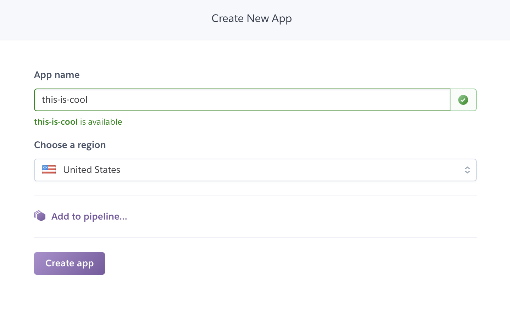
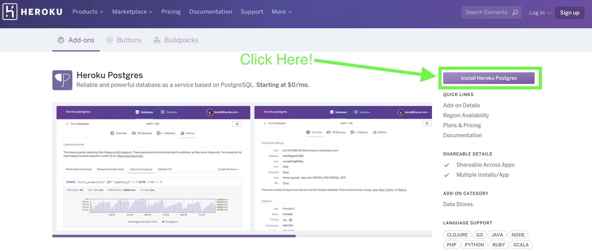
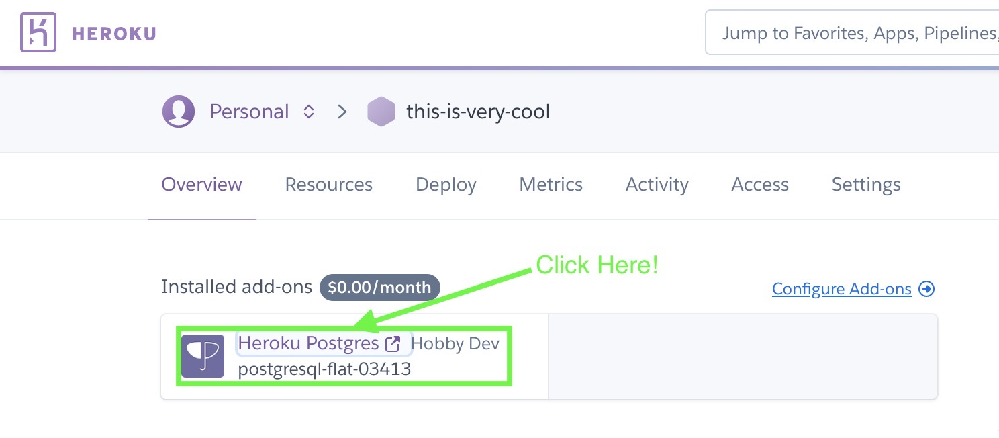
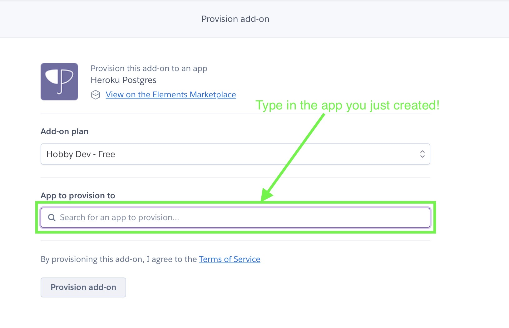
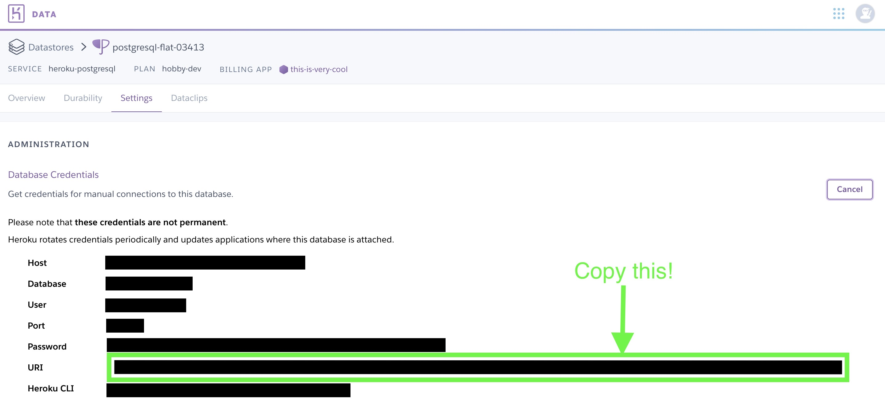

# PostgreSQL_Heroku_Tutorial
Create and connect to a Heroku PostgreSQL server by using Python in a Jupyter Notebook!

Authors: Daniel Kim & Dae Han

**To examine a real-life project application of this notebook, click here on Dae's [capstone](https://github.com/dae-han/nyc_homeless_pop_prediction/blob/master/production/1_Data_Wrangling%2BDatabase_Construction.ipynb). He built a time series model to forecast the total number of individuals sheltered by the NYC Department of Homeless Services (DHS).**

**First, go to heroku and sign up for a free account -  https://www.heroku.com/postgres**

**Click "Create new app"**


**Choose a descriptive and unique App name then click "create app"**


**Click on this [heroku add on link](https://elements.heroku.com/addons/heroku-postgresql) and click "Install Heroku Postgres"**


**Link the postgres add on to the app you just named.**



**Click on "Heroku Postgres" and go to the settings and click on the database credentials.**


**<font color="red">Note: Credentials are not permanent! There are other ways to obtain credentials, but this is just a simple example</font>**


Store the URI in a json file named `creds.json`.

The format in `creds.json` should be the following: ```{"uri" : "your-uri-credentials"}```. Take notice of the double quotations!

**<font color="red">DO NOT UPLOAD YOUR JSON FILE ONTO GITHUB! INCLUDE THE `creds.json` FILE IN THE GITIGNORE TEXT</font>**

